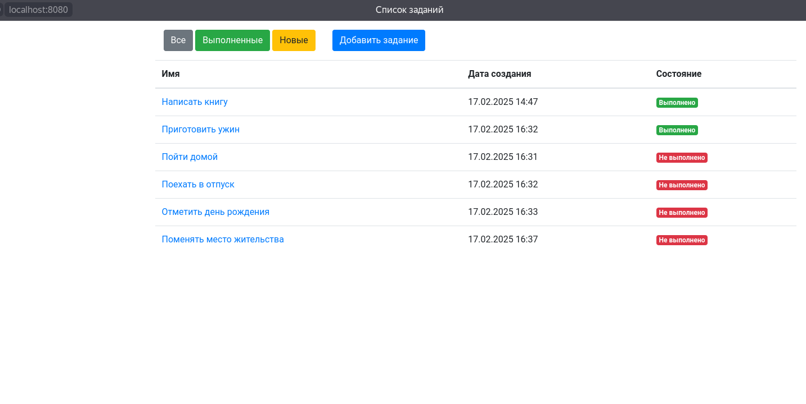
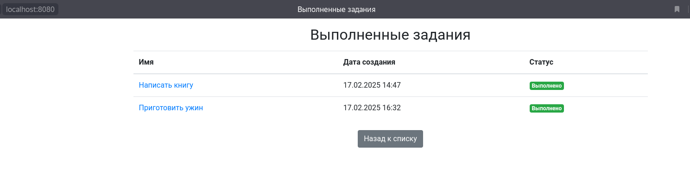
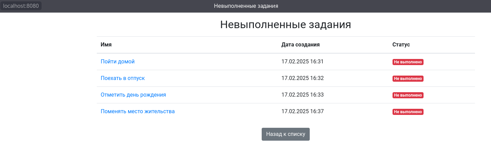
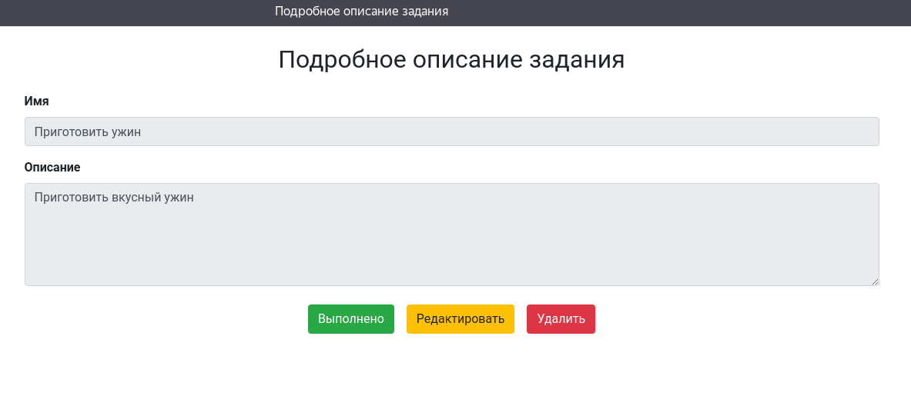
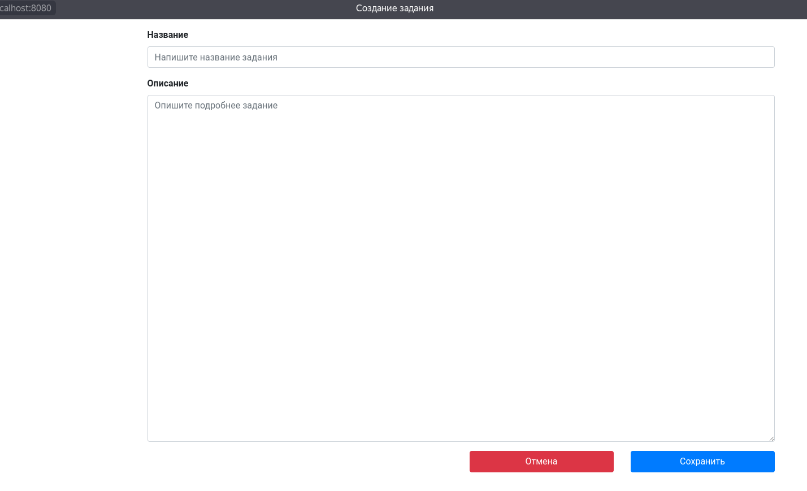
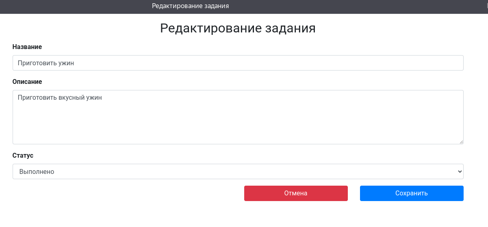

# Приложение "TODO список"

## Описание проекта

TODO список - это приложение для управления списком заданий.</br>

Сервис позволяет:
1. Создать новое задание.
2. Просмотреть список всех заданий.
3. Отредактировать задание.
4. Сменить статус задания на "Выполнено".
5. Удалить задание.

### Технологии используемые в проекте:
- Java 17
- Spring boot 2.7.3
- Tomcat
- Thymeleaf 3.0.15
- Bootstrap
- Liquibase 4.15.0
- PostgreSQL 42.2.9
- H2 2.2.220
- Junit5
- Jacoco 0.8.7
- AssertJ
- Mockito

### Требования к окружению:
- Java 17
- Maven 3.9.6
- PostgreSQL 16.3

# Запуск

1. Создайте Postgres базу данных "todo"
```
CREATE DATABASE todo
```

2. Клонируйте репозиторий
```
git clone https://github.com/hrodvar-one/job4j_todo
```

3. Переходим в папку куда склонировали проект
```
cd job4j_todo
```

4. Соберите проект с помощью Maven под профилем "production":
```
mvn clean install -Pproduction
```

5. Запустите приложение:
```
mvn spring-boot:run
```
После запуска, проект будет доступен по адресу: [http://localhost:8080](http://localhost:8080)

Взаимодействие с приложением:

1. Главная



2. Завершенные задания



3. Невыполненные задания



4. Просмотр выбранного задания



5. Добавление нового задания



6. Редактирование выбранного задания



## Контакты

Telegram: @hrodvar