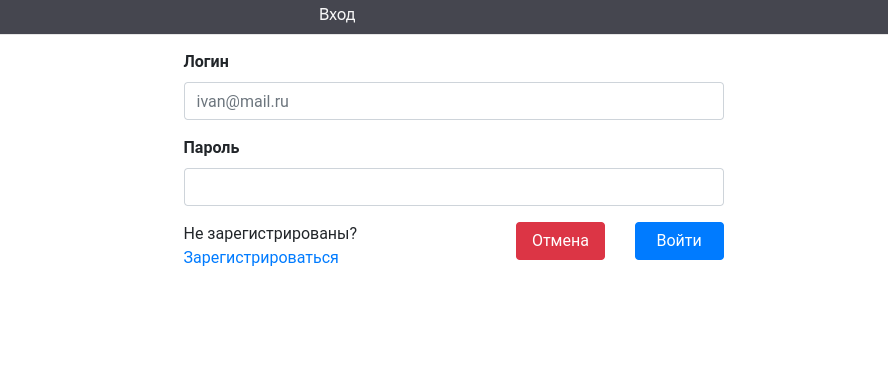
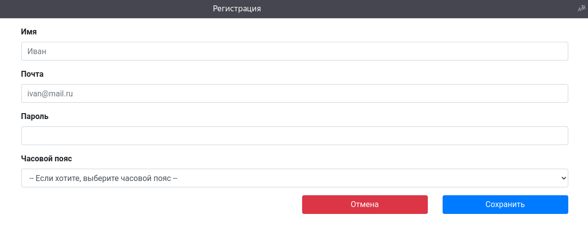
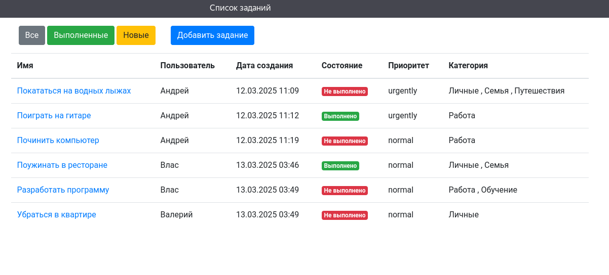
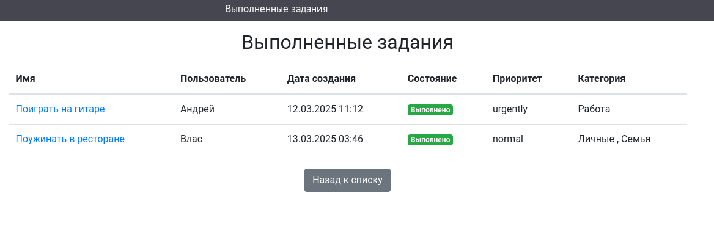
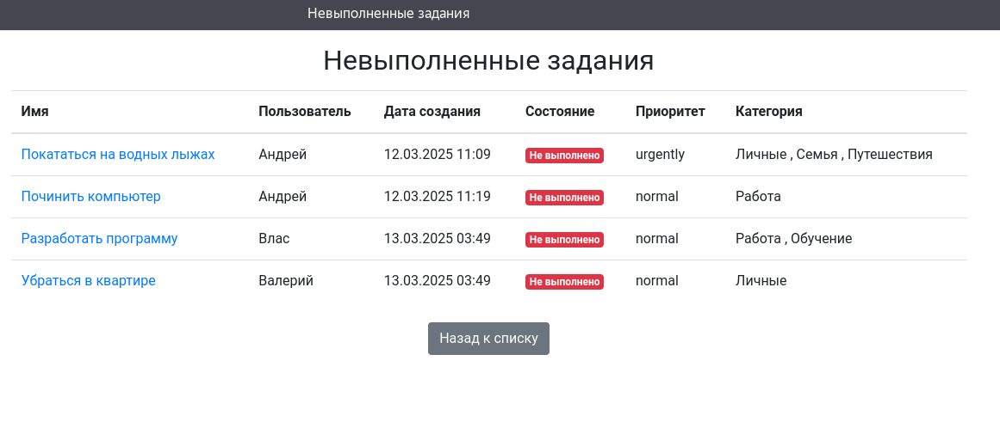
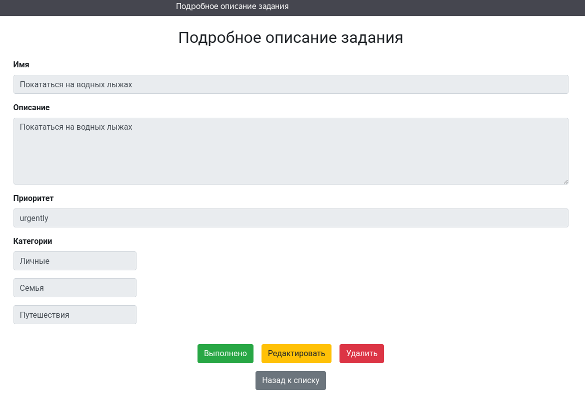
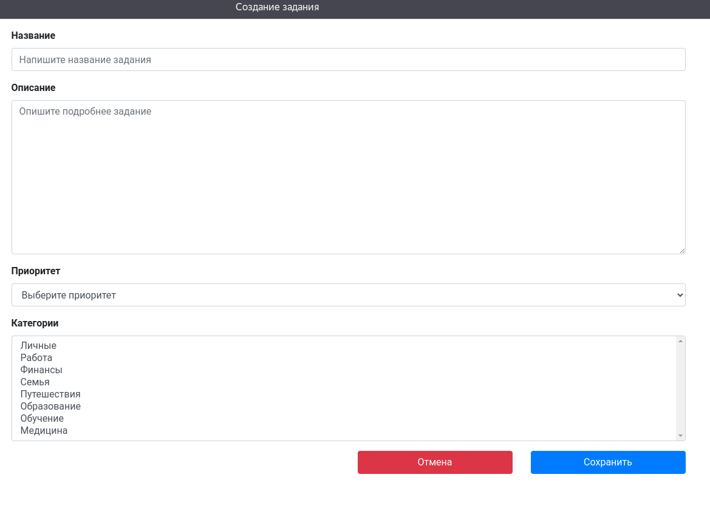
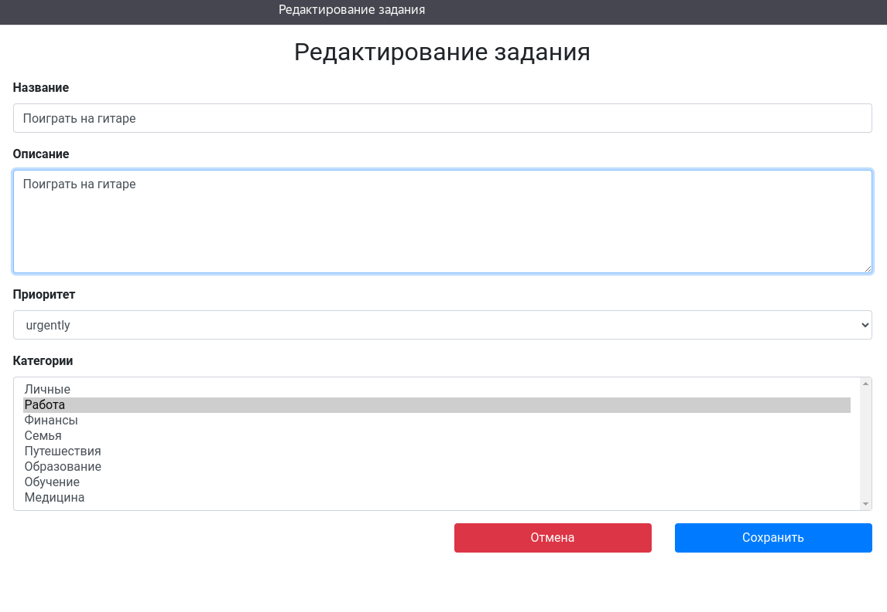

# Приложение "TODO список"

## Описание проекта

TODO список - это приложение для управления списком заданий.</br>

Сервис позволяет:
1. Создать новое задание.
2. Просмотреть список всех заданий.
3. Отредактировать задание.
4. Сменить статус задания на "Выполнено".
5. Удалить задание.

### Технологии используемые в проекте:
- Java 17
- Spring boot 2.7.3
- Hibernate 5.6.11.Final
- Tomcat
- Thymeleaf 3.0.15
- Bootstrap
- Liquibase 4.15.0
- PostgreSQL 42.2.9
- H2 2.2.220
- Junit5
- Jacoco 0.8.7
- AssertJ
- Mockito
- Docker
- Docker Compose

### Требования к окружению:
- Интернет
- Docker
- Docker Compose

# Запуск

1. Установите и запустите Docker и Docker Compose<br><br>

2. Склонируйте репозиторий
```
git clone https://github.com/hrodvar-one/job4j_todo
```

3. Перейдите в папку куда склонировали проект
```
cd job4j_todo
```

4. В командной строке из папки выполните команду:
```
docker-compose up --build
```
Дождитесь развёртывания Docker контейнеров.
Запущенный проект будет доступен по адресу: [http://localhost:8080](http://localhost:8080)

Взаимодействие с приложением:

1. Страница входа



2. Страница регистрации



3. Главная страница



4. Выполненные задания



5. Невыполненные задания



6. Просмотр выбранного задания



7. Добавление нового задания



8. Редактирование выбранного задания



## Контакты

Telegram: @alex_dev_java